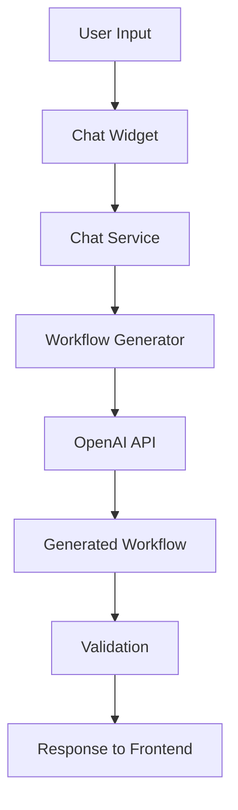
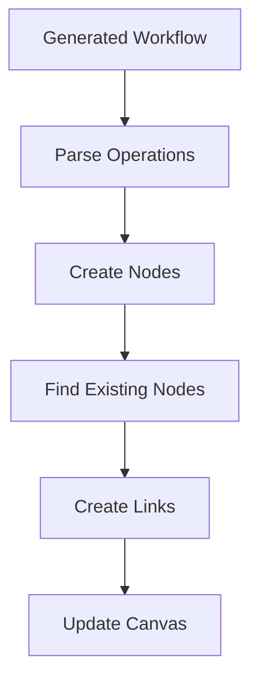

# AI Chat System Architecture

## 🏗️ Overview

The OneFlow AI Chat system is a sophisticated workflow generation engine that combines natural language processing with ComfyUI's node-based architecture. This document provides a technical overview of how the system works.

## 📋 System Components

### Frontend Components

#### 1. Chat Widget (`web_extensions/chat_widget.js`)
- **Purpose**: User interface for AI interactions
- **Key Functions**:
  - `sendMessage()`: Handles user input and API communication
  - `findExistingNodeById()`: Locates nodes on the canvas
  - `linkNodesOnCanvas()`: Creates connections between nodes
  - `applyWorkflowToCanvas()`: Renders AI-generated workflows

#### 2. Chat Styles (`web_extensions/chat_widget.css`)
- **Purpose**: Visual styling for the chat interface
- **Features**: Responsive design, animations, theme integration

### Backend Components

#### 1. Chat Service (`app/chat_service.py`)
- **Purpose**: Main orchestrator for AI chat functionality
- **Key Methods**:
  - `generate_workflow()`: Processes user requests
  - `get_current_workflow_context()`: Analyzes existing canvas state
  - `validate_workflow()`: Ensures generated workflows are valid

#### 2. Workflow Generator (`app/workflow_generator.py`)
- **Purpose**: AI-powered workflow creation engine
- **Key Features**:
  - OpenAI GPT integration
  - Context-aware node generation
  - Smart node linking logic

#### 3. Node Info Collector (`app/node_info_collector.py`)
- **Purpose**: Provides AI with information about available nodes
- **Functions**:
  - Scans builtin and custom nodes
  - Generates node descriptions for AI context
  - Maintains node capability database

## 🔄 Data Flow

### 1. User Request Processing



### 2. Workflow Application



## 🧠 AI Integration

### OpenAI Configuration

The system uses OpenAI's GPT models for workflow generation:

```python
# Configuration in workflow_generator.py
OPENAI_MODEL = "gpt-4"
MAX_TOKENS = 2000
TEMPERATURE = 0.7
```

### System Prompts

The AI is guided by carefully crafted system prompts that include:
- Available node types and their capabilities
- Workflow generation patterns
- Node linking rules and constraints
- Output format specifications

### Context Management

The AI maintains context about:
- **Current Workflow**: Existing nodes and connections
- **Available Nodes**: All registered node types
- **User Intent**: Parsed from natural language input
- **Constraints**: Data type compatibility and workflow rules

## 🔗 Node Linking System

### Node Resolution

The system uses multiple strategies to find and link nodes:

1. **ID-based Lookup**: Direct node ID references
2. **Type-based Search**: Finding nodes by their class type
3. **Semantic Matching**: Fuzzy matching for user descriptions

### Connection Validation

Before creating links, the system validates:
- **Data Type Compatibility**: Ensures output/input types match
- **Slot Availability**: Checks for available connection points
- **Workflow Logic**: Prevents circular dependencies

### Error Handling

Comprehensive error handling includes:
- **Connection Failures**: Graceful degradation when links can't be created
- **Node Not Found**: Clear error messages for missing nodes
- **Type Mismatches**: Detailed explanations of compatibility issues

## 📊 API Endpoints

### Chat API (`/api/chat/generate-workflow`)

**Request Format**:
```json
{
  "message": "User's natural language request",
  "current_workflow": {
    "nodes": [...],
    "links": [...]
  }
}
```

**Response Format**:
```json
{
  "success": true,
  "workflow": {
    "operations": [
      {
        "type": "create_node",
        "node_type": "LoadImage",
        "node_id": "new_node_1",
        "parameters": {...}
      },
      {
        "type": "link_node",
        "source_node_id": "10",
        "target_node_id": "new_node_1",
        "source_slot": "IMAGE",
        "target_slot": "image"
      }
    ]
  },
  "description": "Human-readable description of the workflow"
}
```

## 🔧 Configuration

### Environment Variables

```bash
# OpenAI Configuration
OPENAI_API_KEY=your_api_key_here
OPENAI_MODEL=gpt-4
OPENAI_MAX_TOKENS=2000

# Chat Service Configuration
CHAT_ENABLED=true
CHAT_DEBUG=false
```

### Node Registration

Custom nodes are automatically discovered and registered:

```python
# In custom node files
NODE_CLASS_MAPPINGS = {
    "OpenAIImageEditing": OpenAIImageEditingNode
}

NODE_DISPLAY_NAME_MAPPINGS = {
    "OpenAIImageEditing": "OpenAI Image Editing"
}
```

## 🐛 Debugging

### Frontend Debugging

Enable detailed logging in the browser console:

```javascript
// In chat_widget.js
const DEBUG_MODE = true; // Set to true for detailed logs
```

### Backend Debugging

Enable debug logging in the chat service:

```python
# In chat_service.py
import logging
logging.basicConfig(level=logging.DEBUG)
```

### Common Debug Scenarios

1. **Node Linking Issues**:
   - Check browser console for detailed connection attempts
   - Verify node IDs and slot names
   - Confirm data type compatibility

2. **AI Response Problems**:
   - Review OpenAI API responses
   - Check system prompt effectiveness
   - Validate workflow JSON structure

3. **Performance Issues**:
   - Monitor API response times
   - Check node discovery performance
   - Profile workflow application speed

## 🔒 Security Considerations

### API Key Management
- Store OpenAI API keys securely
- Use environment variables, not hardcoded values
- Implement key rotation policies

### Input Validation
- Sanitize user input before sending to AI
- Validate generated workflows before execution
- Prevent injection attacks through prompts

### Rate Limiting
- Implement rate limiting for AI API calls
- Cache common workflow patterns
- Monitor usage and costs

## 🚀 Performance Optimization

### Caching Strategies
- **Node Info Caching**: Cache node discovery results
- **Workflow Templates**: Store common workflow patterns
- **AI Response Caching**: Cache similar requests

### Async Processing
- Use async/await for API calls
- Implement non-blocking workflow generation
- Provide real-time progress updates

### Resource Management
- Monitor OpenAI API usage and costs
- Implement request queuing for high load
- Optimize node discovery algorithms

## 🔄 Extension Points

### Custom Node Integration
- Automatic discovery of new custom nodes
- Dynamic system prompt updates
- Extensible node capability descriptions

### AI Model Flexibility
- Support for different OpenAI models
- Configurable model parameters
- Fallback model strategies

### Workflow Templates
- Predefined workflow patterns
- User-customizable templates
- Community-shared workflows

## 📈 Monitoring and Analytics

### Key Metrics
- **Success Rate**: Percentage of successful workflow generations
- **Response Time**: AI API response times
- **User Satisfaction**: Workflow application success rate
- **Error Rates**: Types and frequency of errors

### Logging Strategy
- Structured logging for all components
- Request/response tracking
- Performance metrics collection
- Error aggregation and alerting

## 🔮 Future Enhancements

### Planned Features
- **Multi-turn Conversations**: Context-aware follow-up requests
- **Workflow Optimization**: AI-suggested improvements
- **Visual Workflow Builder**: Drag-and-drop interface integration
- **Community Sharing**: Workflow template marketplace

### Technical Improvements
- **Streaming Responses**: Real-time workflow generation
- **Local AI Models**: Reduced dependency on external APIs
- **Advanced Caching**: Intelligent workflow pattern recognition
- **Performance Monitoring**: Real-time system health dashboards

This architecture provides a robust foundation for AI-powered workflow generation while maintaining flexibility for future enhancements and customizations.